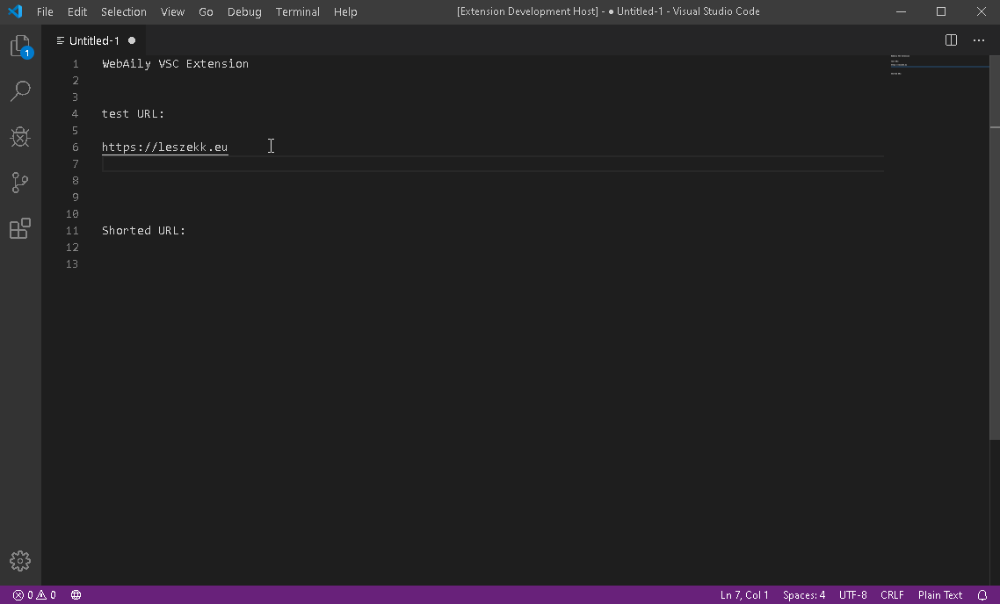

# WebAily README

The **[WebAily](https://webaily.web.app) extension** was created for faster shortening URLS directly from VSC.

Shorten and it will be available as *shortly.page.link/* and *shorter.web.app/* .

## Features

* **fast and easy to use**
* **automatic prompting of the selected link**
* **shortening with WebAily API**
* **option to choose the type of link**
* **support of multiple domains for one shortened link**

> Tip: Many people want to do everything faster and faster, so thanks to this extension they can shorten links without entering the browser for a long time.

### Types of Link
* **short** - e.g. *https://shortly.page.link/5mEq*
* **long** - e.g. *https://shortly.page.link/wvirPBfeUuL5tFEu9*

### Multiple Domains
Links will be available as:
* **https://shortly.page.link/**
* **https://shorter.web.app/**

## Issues

If you find any error in the extension please let me know on [GitHub](https://github.com/leszekkorzan/WebAily-Short-VSC/issues)!

### For more information

* **[Checkout my portfolio](https://leszekk.eu)**
* **[Checkout my GitHub](https://github.com/leszekkorzan)**

**&copy; 2020 Leszek Korzan** *(leszekk.eu)*

**&copy; 2020 WebAily.web.app**